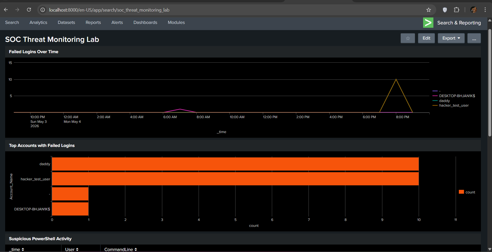
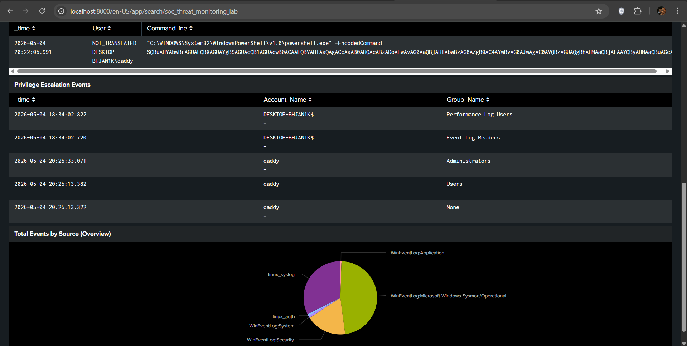
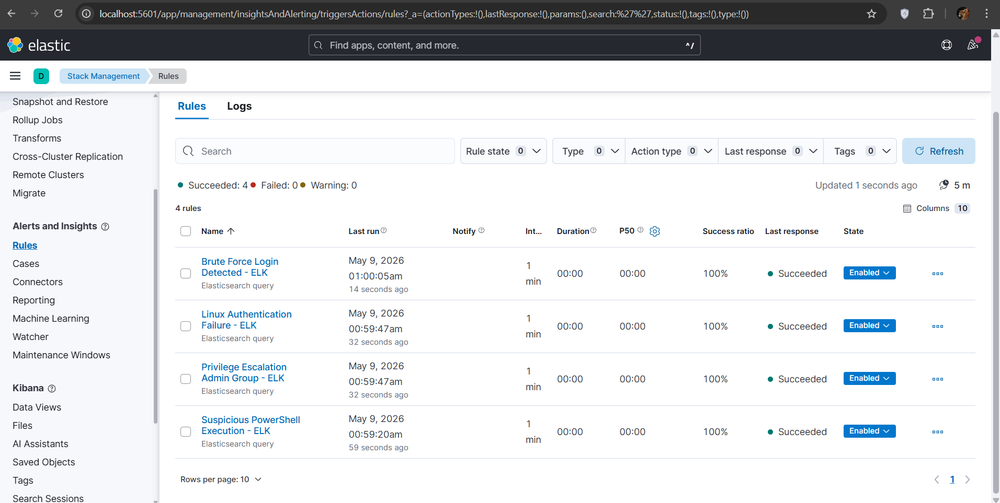

# 🔐 SIEM Threat Detection Lab

A hands-on Security Operations Center (SOC) lab built with **Splunk Enterprise** 
on Windows, using **Sysmon** and **Linux auth logs** to detect real-world attack 
patterns.

---

## 🧪 Lab Architecture

| Component | Role |
|---|---|
| Windows PC (Host) | Runs Splunk SIEM + Sysmon |
| Ubuntu Linux VM (VirtualBox) | Attack target + log source |
| Splunk Universal Forwarder | Ships Linux logs to Splunk |
| Sysmon (SwiftOnSecurity config) | Deep Windows telemetry |

---

## ⚔️ Attacks Simulated

| Attack | MITRE Technique | Event ID | Result |
|---|---|---|---|
| Brute Force Login | T1110 | 4625 | ✅ Detected |
| PowerShell Misuse | T1059.001 | Sysmon EID 1 | ✅ Detected |
| Privilege Escalation | T1078 | 4728/4732 | ✅ Detected |

---

## 📊 Dashboard

Built a real-time SOC monitoring dashboard in Splunk showing:
- Failed logins over time
- Top accounts with failed logins
- Suspicious PowerShell activity
- Privilege escalation events
- Total events by log source

---

## 🚨 Detections

All detection rules are documented in the [`detections/`](./detections/) folder with:
- Splunk SPL queries
- MITRE ATT&CK mapping
- Severity ratings
- False positive considerations

---

## 📄 Incident Report

A full incident report covering all 3 detected attacks is available here:
[`incident-report.md`](./Incident-report.md)

---

## 🔍 Key Findings

**Brute Force:** 10 failed login attempts from `hacker_test_user` detected 
within 60 seconds — consistent with automated credential stuffing tooling.

**PowerShell:** Base64 encoded command execution captured by Sysmon — 
technique matches real-world malware delivery patterns (T1059.001).

**Privilege Escalation:** Account addition to Administrators group detected 
in real-time via EventCode 4728 — zero detection delay.

---

## 🛠️ Tools Used

- Splunk Enterprise (Free License)
- Microsoft Sysmon + SwiftOnSecurity config
- VirtualBox + Ubuntu Server 22.04
- Splunk Universal Forwarder
- Windows Event Logs (Security, System, Application)

---

## 📚 What I Learned

- End-to-end SIEM deployment and configuration
- Log ingestion from Windows and Linux sources
- Detection engineering with correlation rules
- MITRE ATT&CK framework application
- Incident documentation and SOC workflow

---

---

## 🟡 ELK Stack Addition (Elasticsearch + Logstash + Kibana)

To demonstrate platform versatility, the lab was extended with a full 
ELK Stack deployment running alongside Splunk.

### ELK Architecture

| Component | Role |
|---|---|
| Elasticsearch 8.13.0 | Log storage and indexing (Docker) |
| Kibana 8.13.0 | Visualisation and SIEM dashboard (Docker) |
| Logstash 8.13.0 | Log pipeline and processing (Docker) |
| Winlogbeat 8.13.0 | Ships Windows/Sysmon logs to ELK |
| Filebeat 8.13.0 | Ships Linux auth logs to ELK |

### ELK Results

| Metric | Value |
|---|---|
| Total events indexed | 85,000+ |
| Windows Sysmon events | 44,609 |
| Linux auth events | 11,020+ |
| Detection rules created | 4 |
| Rule success rate | 100% |

### ELK Detection Rules (KQL)

| Rule | Query | Severity |
|---|---|---|
| Brute Force Login | `winlog.event_id : "4625"` > 4 in 5min | High |
| PowerShell Misuse | `winlog.event_data.CommandLine : *EncodedCommand*` | Critical |
| Privilege Escalation | `winlog.event_id : "4728" or "4732"` | Critical |
| Linux Auth Failure | `message : *authentication failure*` | Medium |

### Splunk vs ELK — Key Differences Observed

| | Splunk | ELK Stack |
|---|---|---|
| Query language | SPL | KQL |
| Setup complexity | Low | Medium |
| Log ingestion agent | Universal Forwarder | Beats (Winlogbeat/Filebeat) |
| Dashboard builder | Classic/Studio | Kibana Lens |
| Alerting | Built-in, simple | Requires encryption key setup |
| Field naming | `EventCode` | `winlog.event_id` / `event.code` |
| Cost | Free up to 500MB/day | Free + Trial for SIEM features |
| Best for | Enterprise SOC teams | Cloud-native, open source orgs |

## Link to the Medium.com Article
- [How I Built a Home Soc Lab](https://medium.com/@patrickalabi97/how-i-built-a-home-soc-lab-that-detects-real-attacks-using-splunk-step-by-step-81593bc56978)

## 🔗 References
- [MITRE ATT&CK](https://attack.mitre.org)
- [SwiftOnSecurity Sysmon Config](https://github.com/SwiftOnSecurity/sysmon-config)
- [Splunk Documentation](https://docs.splunk.com)
